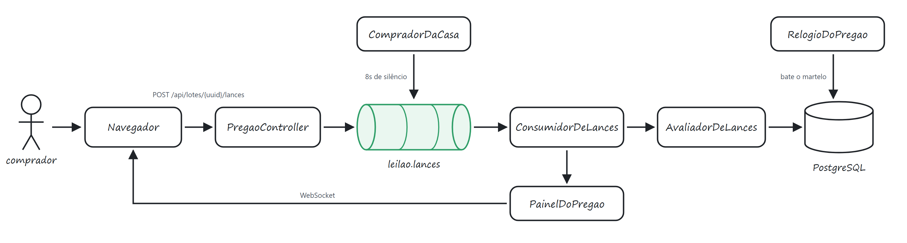

# Plataforma de Leilão — Haras Real

Leilão de cavalos Mangalarga Marchador: cadastro e login dos compradores, catálogo de leilões e lotes, administração de grupos e permissões, e o pregão ao vivo — onde os lances passam por uma fila no Kafka antes de serem julgados.

As duas partes mais densas moram em arquivo próprio: [docs/pregao.md](docs/pregao.md) tem a arquitetura do pregão, [docs/modulo-leiloes.md](docs/modulo-leiloes.md) tem as decisões do catálogo.

## Stack

Backend em Java 17 com Spring Boot 4.0.6, Spring Data JPA, Flyway e PostgreSQL. O token é jjwt 0.12.6, a senha é BCrypt, e o pregão usa Spring Kafka mais WebSocket/STOMP.

Frontend em React 19, Vite 8 e React Router 7, com `@stomp/stompjs` no canal do pregão. Sem biblioteca de estado nem de UI: o estado fica em hooks próprios e o CSS é escrito à mão.

O broker é o Redpanda, que fala a API do Kafka. Sobe junto do Postgres pelo `docker-compose.yml`.

## Como rodar

Precisa de JDK 17+, Node 20+, PostgreSQL em `localhost:5432` e Docker — este último só para o broker.

**Banco.** Crie o banco vazio; o Flyway monta e migra o schema sozinho na subida.

```sql
CREATE DATABASE "plataforma-leilao";
```

Repare que `ddl-auto=validate` está ligado. O Hibernate não altera estrutura nenhuma, quem faz isso é o Flyway, e campo novo na entidade sem a migração correspondente derruba a aplicação na inicialização.

**Broker.**

```bash
docker compose up -d
```

Redpanda em `localhost:9092` e o console web em `localhost:8081`, onde dá para abrir os tópicos, ver as partições e ler as mensagens — elas trafegam em JSON puro justamente para isso. É o modo padrão. Sem Docker na máquina, troque `app.pregao.transporte` para `direto` e o lance passa a ser avaliado dentro da própria requisição.

**Backend e frontend.**

```bash
./mvnw spring-boot:run
```

```bash
cd frontend && npm install && npm run dev
```

API em `localhost:8080`, tela em `localhost:5173`. `VITE_API_URL` troca o endereço da API. Na primeira execução os seeds criam os grupos de permissão e um leilão de exemplo com três lotes.

**Simulador.** Abra o pregão pela tela e rode com o uuid que aparece na URL do leilão:

```bash
pip install -r simulador/requirements.txt
python simulador/simular_pregao.py --leilao <uuid> --compradores 5
```

`--caos` intercala lances inválidos de propósito, um de cada motivo. `--empate` dispara o mesmo valor de todos os compradores no mesmo instante: só um entra, e os outros caem na tela de recusas como `VALOR_INSUFICIENTE`. É a demonstração mais direta da regra de prioridade.

**Primeiro acesso.** Cadastro novo cai no grupo Participante, que só acompanha e dá lance. O e-mail definido em `AdminConstants.EMAIL_ADMIN` vira administrador no cadastro e em todo login — é por ali que se entra para administrar. Para promover outra conta sem mexer no código, use *Administração → Usuários*.

## Como o projeto está montado

```
src/main/java/com/plataforma_leilao/app/
├── config/          seeds, CORS, Kafka, WebSocket
├── controller/      endpoints REST e o handler de exceções
├── dto/             contratos de entrada e saída da API
├── exceptions/      uma exceção por cenário de negócio
├── model/           entidades JPA e enums
├── pregao/          tudo do pregão ao vivo
│   └── kafka/       tópicos, publicador, consumidor, serialização
├── repository/      Spring Data
├── security/        JWT e usuário autenticado
└── service/         regra de negócio de usuário, admin e leilão

frontend/src/
├── api/             clientes HTTP e o canal WebSocket
├── components/      componentes de tela, agrupados por área
├── hooks/           estado e efeitos — formulários, sessão, pregão
├── pages/           uma por rota
├── styles/          CSS por área
└── utils/           formatação, sessão, permissões
```

No frontend a regra é: o hook guarda estado e fala com a API, o componente só desenha. `useNovoLote` sabe montar e enviar o lote, `FormularioNovoLote` só sabe desenhar os campos.

## Modelo de domínio

```
usuario ──┐
          ├── lance ──► lote ──► leilao
animal ◄──┘              │
   │                     └──► animal
   └── pai / mae (auto-relacionamento)

grupo_permissao ──< grupo_permissao_item
        │
        └──► usuario
```

O **animal** é o cadastro do cavalo, com genealogia por auto-relacionamento. O **lote** é esse animal colocado em oferta num leilão, com valor inicial, incremento mínimo, valor de reserva e a janela do pregão (`abertoEm`, `fechaEm`). O **lance** é a oferta de dinheiro em cima do lote — vale separar os dois na cabeça, porque no dia a dia a gente fala "lote" querendo dizer "lance".

O **usuário** tem e-mail único, senha em BCrypt, um papel (`ADMIN`/`USER`) e um grupo de permissão. O campo `ativo` permite desativar sem apagar.

`leilao`, `lote` e `animal` carregam duas chaves: o `id BIGINT`, usado nas FKs, e o `uuid`, que é o que sai na API e na URL. O porquê está em [Identificador público em UUID](#identificador-público-em-uuid).

Os enums do domínio: `ELeilaoStatus` (`RASCUNHO`, `AGENDADO`, `EM_ANDAMENTO`, `ENCERRADO`, `CANCELADO`), `ELoteStatus` (`DISPONIVEL`, `ENCERRADO`, `VENDIDO`, `RESERVA_NAO_ATINGIDA`), `ETipoOferta`, `ETipoLance` (`REAL` do comprador, `SIMULADO` da casa), `EStatusLance`, `EPermissao` e `EUserPermission`.

## Autenticação

No login o `JwtService` emite um JWT em HS256 válido por 24 horas, com `jti`, o e-mail no subject e os claims `userId`, `admin` e `permissoes`. O frontend guarda a sessão em `localStorage` quando *Manter-me conectado* está marcado, e em `sessionStorage` quando não está.

O `JwtAuthFilter` intercepta tudo sob `/api/`, menos login e cadastro. Sem token válido, `401 TOKEN_INVALIDO`. O que não começa com `/api/` passa direto — inclusive o handshake do WebSocket em `/ws`, que por isso ganhou a própria checagem no CONNECT do STOMP.

Existem dois níveis empilhados: o papel e o grupo de permissões. `User.temPermissao()` resolve os dois — administrador pode tudo, os demais dependem do grupo. Quem barra no backend é `PermissaoService.exigir()`, com `403`. No frontend, `utils/permissions.js` decide o que aparece na tela, mas quem de fato protege é o backend.

Nas rotas, `ProtectedRoute` manda para `/login` quem não tem sessão e guarda o destino para voltar depois; `PublicRoute` faz o contrário. A sessão vale só enquanto o `exp` do token não passou: `getSessao()` lê a expiração do próprio JWT e descarta do storage o que venceu.

## Endpoints

Tudo sob `/api` exige `Authorization: Bearer <token>`, menos as duas rotas de usuário.

| Método | Rota | Permissão | O que faz |
|---|---|---|---|
| `POST` | `/api/user/cadastrar` | — | Cria a conta. `201` sem corpo |
| `POST` | `/api/user/login` | — | Devolve token, grupo, papel e permissões |
| `GET` | `/api/leiloes` | — | Lista os leilões com a contagem de lotes |
| `GET` | `/api/leiloes/{uuid}` | — | Leilão com todos os lotes |
| `POST` | `/api/leiloes` | `CRIAR_LEILAO` | Cria leilão, opcionalmente já com lotes |
| `POST` | `/api/leiloes/{uuid}/lotes` | `CRIAR_LEILAO` | Acrescenta um lote |
| `GET` | `/api/leiloes/{uuid}/pregao` | — | Estado completo: lote aberto, fila e encerrados |
| `POST` | `/api/leiloes/{uuid}/pregao/iniciar` | `CRIAR_LEILAO` | Abre o pregão e o primeiro lote |
| `POST` | `/api/leiloes/{uuid}/pregao/avancar` | `CRIAR_LEILAO` | Bate o martelo e abre o próximo |
| `POST` | `/api/leiloes/{uuid}/pregao/encerrar` | `CRIAR_LEILAO` | Fecha o lote aberto e encerra o leilão |
| `POST` | `/api/leiloes/{uuid}/pregao/reabrir` | `CRIAR_LEILAO` | Devolve ao ar o último lote de um pregão encerrado |
| `POST` | `/api/lotes/{uuid}/lances` | — | Enfileira um lance. `202` |
| `GET` | `/api/leiloes/{uuid}/recusas` | `CRIAR_LEILAO` | Lances que não entraram, com o motivo |
| `GET` | `/api/pregao/falhas` | `CRIAR_LEILAO` | Mensagens que pararam na DLT |
| `GET` `POST` `PUT` | `/api/admin/grupos`, `/api/admin/permissoes` | `GERENCIAR_GRUPOS` | Grupos e suas permissões |
| `GET` `PUT` | `/api/admin/usuarios` | `GERENCIAR_USUARIOS` | Usuários e o grupo de cada um |

No `POST` de lote, `numero` e `incrementoMinimo` são opcionais: o serviço completa com o próximo número livre do leilão e o incremento padrão de R$ 500. O animal vem por `animalUuid`, reaproveitando um cadastro, ou por `animal`, criando um novo.

O corpo do lance é `{ "lanceUuid": "...", "valor": 62000 }`. O `lanceUuid` é a chave de idempotência e precisa vir do cliente; quando não vem, o servidor gera um e cada reenvio conta como lance novo. O `202` diz que o lance entrou na fila, não que foi aceito — o desfecho chega pelo WebSocket.

O canal STOMP fica em `/ws`, com o token no header `Authorization` do CONNECT. Cada leilão tem o seu `/topic/pregao/{leilaoUuid}`, por onde passam três tipos de evento: `LANCE`, `LOTE` e `PREGAO`.

Todo erro sai no mesmo formato, `{ "code": "...", "message": "..." }`, montado pelo `DefaultExceptionHandler`:

| Código | HTTP | Quando |
|---|---|---|
| `CREDENCIAIS_INVALIDAS` | 401 | E-mail ou senha errados, ou conta inativa |
| `TOKEN_INVALIDO` | 401 | Token ausente, expirado ou adulterado |
| `ACESSO_NEGADO` | 403 | Falta a permissão exigida |
| `EMAIL_CADASTRADO` | 400 | E-mail já existe |
| `SENHA_VAZIA` / `SENHA_CADASTRADA` | 400 | Senha nula, ou fora do padrão exigido |
| `PARAMETRO_INVALIDO` | 400 | UUID malformado na URL |
| `LEILAO_NAO_ENCONTRADO` | 404 | UUID válido, leilão inexistente |
| `GRUPO_NAO_ENCONTRADO` / `USUARIO_NAO_ENCONTRADO` | 404 | — |
| `LEILAO_ENCERRADO` | 409 | Tentativa de somar lote a leilão fechado |
| `PREGAO_INVALIDO` | 409 | Comando que não cabe no estado atual |
| `PREGAO_INDISPONIVEL` | 503 | Broker fora do ar |
| `ERRO_INESPERADO` | 500 | Exceção não mapeada |

## Pregão ao vivo



O caminho de um lance tem duas metades. Na primeira, o navegador manda o POST e o `PregaoController` responde `202` e publica na fila — ele não julga nada, só confirma que a tentativa entrou. Na segunda, o `ConsumidorDeLances` tira o lance da fila, o `AvaliadorDeLances` decide se ele vale e grava, e o `PainelDoPregao` devolve o desfecho pelo WebSocket. Entre o consumidor e o avaliador ainda passa o `ProcessadorDeLances`, que ficou fora do desenho porque só registra o lance no log e avisa o painel.

Os dois de cima rodam sozinhos, a cada segundo. O `CompradorDaCasa` é um segundo produtor na mesma fila: depois de 8 segundos de silêncio publica um lance da casa, que passa exatamente pelas mesmas regras de um lance de comprador. O `RelogioDoPregao` é o único que escapa da fila — procura lote com o tempo vencido e bate o martelo direto no banco, que é como um lote fecha sozinho.

Ficaram de fora do desenho os outros dois tópicos (`leilao.lances-resultado` e a DLT) e o modo `direto`, que pula a fila inteira. Os três estão explicados logo abaixo.

A fila no meio existe por causa de um problema só: dois compradores cobrindo o mesmo lote no mesmo instante. Ela resolve isso pela chave da mensagem, não pela velocidade.

São três tópicos: `leilao.lances` com as tentativas ainda sem julgamento, `leilao.lances-resultado` com o que o pregão decidiu, e `leilao.lances.DLT` com o que nem o retry conseguiu processar. Os dois primeiros têm 6 partições, a DLT tem uma.

A chave de toda mensagem é o uuid do lote, e é isso que faz os lances de um mesmo lote caírem sempre na mesma partição: eles são avaliados em fila, um de cada vez, enquanto lotes diferentes seguem em paralelo.

`AvaliadorDeLances` é o único ponto do sistema que altera o valor corrente de um lote. A ordem das checagens importa, porque é ela que decide qual motivo aparece quando mais de um se aplica: uuid repetido, lote inexistente, comprador inexistente, leilão fora do ar, lote fechado, lote ainda não aberto, auto-lance, valor abaixo do próximo, incremento quebrado e, por último, valor acima do teto de sanidade. Passando por tudo, o lance entra e empurra o cronômetro se estiver perto do fim.

Aceito ou recusado, o lance vira linha na tabela `lance` — `VALIDO`, ou `INVALIDO` com o motivo. É desse histórico que sai a tela de recusas. Falha de infraestrutura é outra categoria: mensagem que nem o retry processou vai para a DLT e aparece em seção separada, porque ela não chegou a ser julgada.

Duas regras dão o ritmo do pregão. O **soft close**: lance nos últimos 10 segundos empurra o fechamento para 10 segundos adiante, senão todo mundo espera o último instante e ganha quem tem a rede mais rápida. E o **lance da casa**: passados 8 segundos de silêncio, a casa cobre em nome do vendedor até o `valorReserva` do lote e para ali. Sai pela mesma fila, com tipo `SIMULADO`, passa pelas mesmas regras e aparece identificado na tela. A casa nunca cobre o próprio lance.

O lote fecha como `VENDIDO` se o último de pé for comprador real com valor acima da reserva; `RESERVA_NAO_ATINGIDA` se ficou abaixo; e `ENCERRADO` se não houve lance nenhum ou se quem sobrou foi a casa — ela segura o preço, não compra o animal.

Quem bate o martelo sozinho é o `RelogioDoPregao`, que roda a cada segundo procurando lotes com `fechaEm` vencido. A lista que ele monta é só um palpite: quem confirma é `baterMartelo`, já com a linha do lote travada. Se chegou lance no meio do caminho, o `fechaEm` foi adiado e nada acontece. Fechado o lote, o próximo abre sozinho; acabando os lotes, o leilão encerra.

Na tela, o estado completo vem por REST e o canal traz o que muda com ela aberta. Lance aceito é aplicado na hora; troca de lote ou de status recarrega tudo, porque nesses casos muita coisa muda junto e remendar em pedaços sairia errado. Para quem tem `CRIAR_LEILAO` aparecem os comandos do leiloeiro e um painel *Reproduzir um caso*, com botões que disparam lance válido, abaixo do pedido, fora do incremento, valor absurdo e reenvio do último com a mesma chave — serve para conferir a tela de recusas sem depender do simulador.

## Configuração

```properties
# "kafka" passa pelo broker, "direto" avalia dentro da requisição
app.pregao.transporte=kafka

# Quanto tempo cada lote fica aberto quando ninguém dá lance
app.pregao.segundos-por-lote=60

# Lance dentro desta janela final empurra o fechamento
app.pregao.soft-close-segundos=10

# Silêncio nesse tempo e a casa dá o próximo lance
app.pregao.segundos-sem-lance-ate-casa=8

# Múltiplo do valor inicial acima do qual o lance vira erro de digitação
app.pregao.fator-valor-suspeito=100

# Validade do token, em milissegundos (24h)
app.jwt.expiration-ms=86400000
```

O endereço do broker aceita a variável `KAFKA_BROKERS`, e o do banco aceita `POSTGRES_HOST`.

O schema tem quatro migrações: o `V1` com o esquema inicial, o `V2` movendo os dados do cavalo do lote para `animal`, o `V3` acrescentando o `uuid` público com backfill, e o `V4` trazendo o pregão — `uuid` e `motivo_recusa` no lance, `usuario_id` nulo para o lance da casa, a janela do lote e os marcos do leilão.

## Decisões

### Identificador público em UUID

O catálogo expunha o id sequencial na URL (`/leiloes/4`). Qualquer pessoa logada trocava o número e ia varrendo os leilões de um em um. Troquei por UUID em `leilao`, `lote` e `animal`: o `BIGINT` continua sendo a chave interna e as FKs, o UUID é o que sai na API.

Fiz nos três porque esconder só o id do leilão não resolvia nada — o `LoteDTO` devolvia `id` e `animalId` sequenciais no mesmo JSON. O `usuario` ficou de fora porque mexer nele arrasta as telas de administração junto.

De quebra, `/api/leiloes/4` passou a responder `400 PARAMETRO_INVALIDO` em vez de `500`: o Spring não converte "4" em UUID, e o handler ganhou o tratamento de `MethodArgumentTypeMismatchException`.

### Quem ganha quando dois lances chegam juntos

Foi a decisão que mais custou. Considerei juntar os lances numa janela de milissegundos e escolher o maior valor — parece mais justo, mas muda a semântica do leilão e o lance deixa de ser instantâneo. Considerei usar o timestamp do cliente, e descartei cedo: relógio de cliente é manipulável e dessincronizado, viraria brecha de fraude.

Ficou o primeiro a chegar. É o que o leiloeiro faz na prática, pega a primeira mão levantada, e é o que o Kafka já entrega de graça quando a chave da mensagem é o uuid do lote.

### Kafka não dá idempotência

Entrei nessa achando que o Kafka resolveria lance duplicado. Não resolve. O que ele dá é ordem por partição — publicando com `key = loteUuid`, os lances de um mesmo lote são avaliados em fila enquanto lotes diferentes seguem em paralelo — e replay, já que todo lance julgado vira evento durável.

A entrega dele é *pelo menos uma vez*: um rebalanceamento de consumidor reentrega mensagem já processada. Deduplicar continua sendo problema da aplicação, e a saída foi o `lance.uuid` gerado por quem dá o lance, com índice único no banco. O avaliador vê o uuid repetido, não grava e devolve `DUPLICADO`.

Somei a isso uma trava pessimista (`SELECT ... FOR UPDATE`) no lote durante a avaliação. Parece redundante, já que a partição entrega um lance por vez, mas cobre o intervalo de rebalanceamento — quando dois consumidores podem se sobrepor por um instante — e cobre o modo sem broker.

### Lance recusado é linha na tabela de lance

Cheguei a pensar em tabela separada para os recusados. Não precisou: `EStatusLance` já tinha `INVALIDO`, e bastou somar a coluna `motivo_recusa`. A tela de problemas virou uma consulta em cima da mesma tabela, e o histórico de um lote fica inteiro num lugar só — o que entrou e o que tentou entrar.

### Lance da casa aparece na tela

O pedido era um comprador fantasma que cobre quando ninguém dá lance. Deixar visível foi decisão consciente: casa cobrindo escondida e sem teto é *shill bidding*; com teto na reserva e etiqueta na tela, é prática legítima. O campo `valorReserva` já existia no modelo, então não custou nada.

### Resposta 202 no lance

O lance podia responder já com o veredito, esperando o consumidor julgar. Seria mais simples de consumir no frontend, mas amarraria a requisição HTTP ao tempo da fila e desfaria o motivo de ter fila. Ficou assíncrono, e a API se comporta igual nos dois modos de transporte — o que evita a tela funcionar em desenvolvimento e quebrar em produção.

### Redpanda no lugar do Kafka

Fala a API do Kafka, então o código Java é o mesmo. Sobe em segundos, é um binário só e consome bem menos memória. Para máquina de desenvolvimento a diferença é grande.

## Onde travei

**A sessão voltava para o login.** Logado no catálogo, abrindo `/login` a tela de login aparecia normalmente. Eram dois problemas empilhados: `/login` e `/cadastro` eram rotas soltas, sem guarda nenhuma — existia o `ProtectedRoute` barrando quem não tem sessão, mas não o contrário —, e `getSessao()` checava se existia token no storage, nunca se ele ainda valia. JWT vencido passava como sessão boa até alguma requisição levar 401. Daí o `PublicRoute`, e o `exp` lido do próprio token.

**A aplicação parou de subir depois de adicionar o Kafka.** `PublicadorKafka required a bean of type KafkaTemplate that could not be found`. No Boot 3 bastava ter o spring-kafka no classpath que a auto-configuração cuidava do resto; no Boot 4 elas foram separadas em módulos próprios e a dependência crua não traz nenhuma. Resolvido trocando por `spring-boot-starter-kafka`.

**Jackson 2 e Jackson 3 no mesmo classpath.** O Boot 4 traz `com.fasterxml.jackson` 2.21 e `tools.jackson` 3.1.2 ao mesmo tempo, e o spring-kafka 4 tem um serializer para cada família. Ficar adivinhando qual o Spring escolheria era pedir para quebrar depois, então fui pelo caminho explícito: `KafkaTemplate<String, String>` com serializer de String e um `JsonMapper` próprio convertendo as mensagens. Como o que trafega é JSON puro sem cabeçalho de tipo, dá para ler as mensagens direto no console do broker.

**`@Transactional` que não fazia nada.** O relógio do pregão chamava `lotesVencidos()`, anotado com `@Transactional(readOnly = true)`, de dentro de outro método da mesma classe. A transação nunca abria: a anotação funciona por proxy, e chamada interna não passa pelo proxy. Estava funcionando por sorte, porque os campos lidos eram todos básicos. Tirei a anotação em vez de deixar um enfeite que engana quem ler depois.

**O e-mail não batia entre o cadastro e o login.** `findByEmail` e o índice único do Postgres comparam byte a byte, então `Carlos@haras.com` e `carlos@haras.com` viravam duas contas — e quem cadastrasse com maiúscula não entrava digitando minúscula. Passei a normalizar com `trim().toLowerCase()` na entrada do `cadastrar` e do `login`. Em base que já tenha conta com maiúscula precisa de um `UPDATE usuario SET email = LOWER(email)` antes, senão essas contas param de logar. O que ficou de fora foi diferenciar "e-mail não existe" de "senha errada" no login: continua tudo como `CREDENCIAIS_INVALIDAS`, de propósito, porque a mensagem específica entregaria quais e-mails têm conta na plataforma.

**O canal do WebSocket estava aberto.** O `JwtAuthFilter` só protege `/api/`. O handshake vai em `/ws`, passava direto, e qualquer um assinava o canal de qualquer leilão. Corrigido com um `ChannelInterceptor` conferindo o token no CONNECT do STOMP.

**O agendador cuspindo stack trace.** Com o broker fora do ar, o `CompradorDaCasa` tentava publicar a cada segundo e cada tentativa jogava a exceção inteira no log. Em pouco tempo não dava para achar mais nada. Passou a capturar a falha e registrar uma linha de aviso: o lance da casa deixa de sair, que é o comportamento certo sem fila, e o log continua legível.

**Desenvolver sem Docker.** O pregão depende do broker e nem toda máquina tem Docker. Em vez de travar, veio o `app.pregao.transporte`: em `kafka` o lance passa pelo broker, em `direto` é avaliado dentro da própria requisição. A trava do lote vale nos dois modos, então o resultado é correto — o que se perde é a ordenação por partição e o replay.

## Em aberto

**`usuario` ainda usa id sequencial.** O `LoginResponseDTO` devolve o id e as telas de administração trabalham com ele. Vale estender o UUID para lá, mas mexe em mais superfície que as outras três tabelas.

**O feed ao vivo mostra o e-mail de quem dá lance.** Num leilão real os concorrentes costumam ser anônimos entre si. As telas de diagnóstico já ficaram restritas a quem tem `CRIAR_LEILAO`; o feed continua aberto por decisão de simulação.

**A DLT só é listada, não reprocessada.** `/api/pregao/falhas` mostra o que parou lá, e para. Falta o caminho de volta: reenviar a mensagem para `leilao.lances` depois de resolver a causa. Hoje, lance que cai na DLT está perdido.

**A normalização do e-mail é código, não constraint.** O `toLowerCase()` resolve para quem passa pelo serviço, mas o banco continua aceitando duas caixas diferentes se alguém inserir por fora. Um índice único em `lower(email)` fecharia de vez.

**`rotuloStatus` não cobre todos os status.** O mapa em `utils/format.js` traduz `AGENDADO`, `EM_ANDAMENTO` e `ENCERRADO`. `RASCUNHO` e `CANCELADO` aparecem na tela com o nome cru do enum.

**Sem testes automatizados.** As dependências estão no pom, mas não há nada escrito. O `AvaliadorDeLances` é o candidato mais óbvio: é lógica pura sobre entidades, com uma dúzia de cenários bem definidos. Hoje quem faz esse papel é o simulador, na mão.
